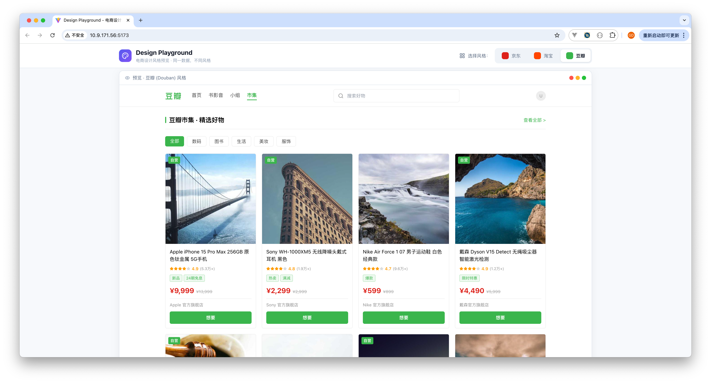
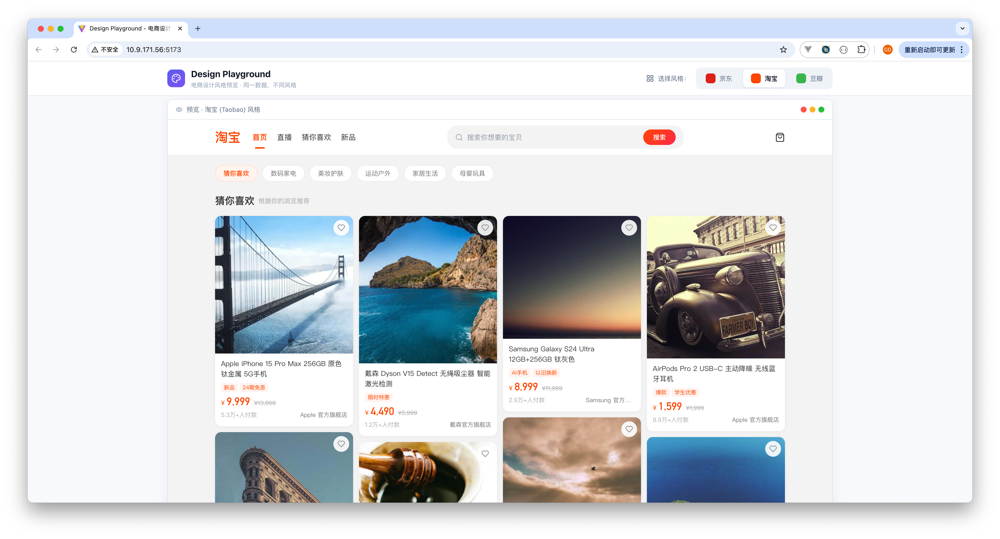

# Design MD Generator

从任意网站或本地源码生成 `DESIGN.md` 文件。使用 Puppeteer 访问在线网站，或通过静态分析本地源码，提取设计令牌（颜色、排版、组件、布局、阴影、响应式断点），输出遵循 [Google Stitch DESIGN.md 格式](https://stitch.withgoogle.com/docs/design-md/overview/) 的结构化 Markdown 文档。

## 快速开始

```bash
# 安装依赖
npm install

# 模式一：从在线网站生成 DESIGN.md
node src/cli.js url https://stripe.com

# 模式二：从本地源码生成 DESIGN.md
node src/cli.js local ./my-project

# 带选项
node src/cli.js url https://stripe.com -o ./output/stripe-DESIGN.md -n "Stripe" --screenshot --json
node src/cli.js local ./my-project -o ./output/project-DESIGN.md -p "src/pages/home" "src/components" --json
```

## 两种提取模式

### 模式一：在线网站提取（URL 模式）

通过 Puppeteer 启动无头浏览器访问目标网站，从实时 DOM 和计算样式中提取设计令牌。

```
Usage: design-md url [options] <url>

参数：
  url                    要提取设计令牌的网站 URL

选项：
  -o, --output <path>    输出文件路径（默认："./DESIGN.md"）
  -n, --name <name>      网站名称（不指定则自动检测）
  -t, --timeout <ms>     导航超时时间，毫秒（默认："30000"）
  -s, --screenshot       保存首页截图
  --json                 同时输出原始令牌的 JSON 文件
  -w, --wait <selector>  提取前等待指定的 CSS 选择器
```

**使用示例：**

```bash
# 基本用法（url 是默认子命令）
design-md url https://stripe.com

# 完整选项
design-md url https://linear.app -o ./output/linear-DESIGN.md -n "Linear" --json --screenshot

# SPA 应用需要额外等待
design-md url https://app.example.com -w ".main-content" -t 60000
```

### 模式二：本地源码提取（Local 模式）

通过静态分析本地前端源码文件（CSS/SCSS/Less/HTML/JSX/TSX/Vue/Svelte），提取设计令牌。无需浏览器，适用于：

- 本地开发中的项目
- 需要认证才能访问的页面
- 需要针对特定页面/组件生成设计文档
- CI/CD 流水线中自动生成设计文档

```
Usage: design-md local [options] <dir>

参数：
  dir                          要分析的源码目录

选项：
  -o, --output <path>          输出文件路径（默认："./DESIGN.md"）
  -n, --name <name>            项目名称（不指定则从 package.json 自动检测）
  -p, --pages <patterns...>    聚焦分析的页面/目录模式（如 "src/pages/home" "components/Header"）
  -i, --include <patterns...>  仅包含匹配这些模式的文件
  -e, --exclude <patterns...>  排除匹配这些模式的文件
  --json                       同时输出原始令牌的 JSON 文件
```

**使用示例：**

```bash
# 分析整个项目
design-md local ./my-react-app

# 聚焦特定页面
design-md local ./my-project -p "src/pages/dashboard" "src/components/shared"

# 排除测试文件
design-md local ./my-project -e "__tests__" "*.test" "*.spec"

# 仅分析特定目录下的样式
design-md local ./my-project -i "src/styles" "src/theme"
```

**支持的文件类型：**

| 类别 | 扩展名 |
|------|--------|
| 样式文件 | `.css`, `.scss`, `.sass`, `.less`, `.styl`, `.stylus` |
| 模板文件 | `.html`, `.htm`, `.jsx`, `.tsx`, `.vue`, `.svelte` |
| 配置文件 | `tailwind.config.*`, `theme.*`, `tokens.*`, `design-tokens.*` |

**自动忽略的目录：** `node_modules`, `.git`, `.next`, `.nuxt`, `dist`, `build`, `out`, `.cache`, `coverage`, `vendor`

## 提取内容

| 类别 | URL 模式提取内容 | Local 模式提取内容 |
|------|-----------------|-------------------|
| **CSS 变量** | 从可访问的样式表中提取所有 `--custom-property` | 从所有样式文件中提取 |
| **颜色** | 从 500+ DOM 元素采样背景色、文字色、边框色 | 从源码中提取 hex/rgb/hsl 颜色值 |
| **语义颜色** | 从关键元素（body、nav、标题、链接、按钮）提取 | 从 CSS 变量命名推断语义角色 |
| **排版** | 字体族、完整层级表（字号、字重、行高、字间距） | 从 font-family/font-size 等声明提取 |
| **组件** | 按钮、卡片、徽章、输入框、导航栏的完整属性 | 从选择器模式匹配提取组件样式块 |
| **布局** | 间距比例尺、max-width、Grid/Flex 使用情况 | 从 padding/margin/gap 声明提取 |
| **阴影** | 所有不同的 box-shadow 值及使用频率 | 从 box-shadow 声明提取 |
| **断点** | 从可访问的样式表中提取媒体查询断点 | 从 @media 规则提取 |
| **元信息** | 页面标题、描述、主题色、深色/浅色模式检测 | 从 package.json 读取项目信息 |
| **Tailwind** | — | 自动检测并解析 tailwind.config.* 配置 |

## Playground 对比效果

基于同一组商品数据，使用从不同网站提取的 `DESIGN.md` 设计令牌，渲染出三种截然不同的视觉风格：

### 京东风格（JD.com）



> 红色主题 · 信息密集 · 网格布局 · 强促销导向

### 淘宝风格（Taobao）



> 橙色主题 · 温暖圆润 · 瀑布流布局 · 发现式购物

### 豆瓣风格（Douban）


> 绿色主题 · 简洁克制 · 扁平设计 · 内容社区电商

## 输出格式（9 大章节）

生成的 `DESIGN.md` 遵循标准的 9 章节格式：

1. **视觉主题与氛围** — 风格基调、设计哲学、关键特征
2. **色彩体系与角色** — 语义化颜色及十六进制值、功能角色
3. **排版规则** — 字体族、完整层级表
4. **组件样式** — 按钮、卡片、输入框、导航栏及其状态
5. **布局原则** — 间距比例尺、Grid、留白哲学
6. **层深与阴影** — 阴影系统、表面层次结构
7. **设计规范与禁忌** — 设计护栏和反模式
8. **响应式行为** — 断点、触控目标尺寸、折叠策略
9. **AI 代理提示指南** — 快速颜色参考、即用型组件提示

## 编程接口

```javascript
const { generateDesignMdFromUrl, generateDesignMdFromLocal } = require('design-md-generator');

// 模式一：从 URL 提取
const result1 = await generateDesignMdFromUrl('https://stripe.com', {
  outputPath: './DESIGN.md',
  siteName: 'Stripe',
  timeout: 30000,
  screenshot: true,
  outputJson: true,
});

// 模式二：从本地源码提取
const result2 = await generateDesignMdFromLocal('./my-project', {
  outputPath: './DESIGN.md',
  siteName: 'My Project',
  pages: ['src/pages/home', 'src/components'],
  exclude: ['__tests__'],
  outputJson: true,
});

// 两种模式返回相同结构
console.log(result1.markdown);       // DESIGN.md 内容
console.log(result1.tokens);         // 原始设计令牌
console.log(result1.colorCount);     // 颜色数量
console.log(result1.fontCount);      // 字体族数量
console.log(result1.componentCount); // 组件样式数量
```

## 已知限制

### URL 模式

- **跨域样式表**：外部 CDN 的 CSS 可能无法提取 CSS 变量
- **JavaScript 渲染内容**：工具等待 `networkidle2`，但重度 SPA 站点可能需要 `--wait` 选项
- **Hover/Focus 状态**：仅捕获默认状态（不模拟交互）
- **深色模式**：提取默认主题；需使用浏览器偏好设置测试深色模式
- **私有/认证页面**：仅支持公开页面

### Local 模式

- **CSS-in-JS**：不支持 styled-components、emotion 等运行时 CSS 方案的完整解析
- **动态样式**：无法捕获通过 JavaScript 动态生成的样式
- **计算值**：无法获取浏览器计算后的实际值（如 `calc()` 表达式）
- **Tailwind 工具类**：仅从配置文件提取，不解析模板中的工具类使用
- **主题切换**：仅分析源码中的静态声明

## 许可证

MIT
